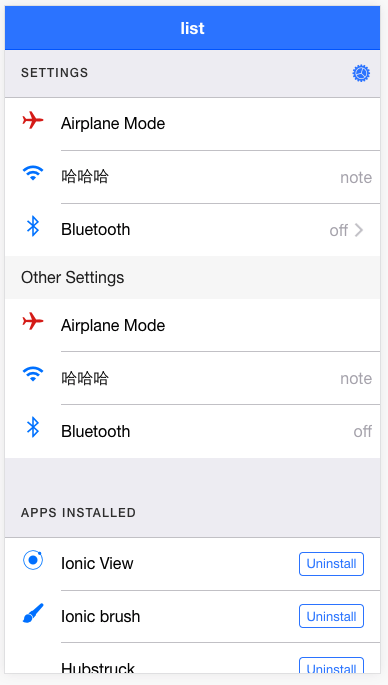
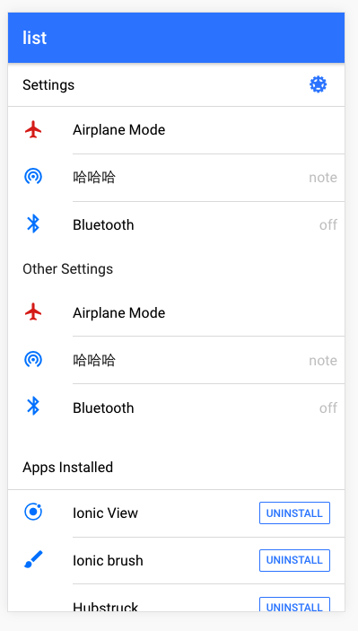
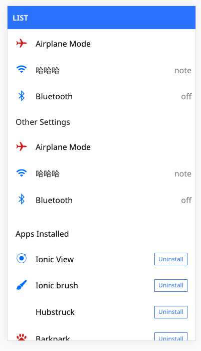

# VUE-IONIC

> vue 2.0 components && ionic2 ui （ionic ui 的 vue 实现版本）
- [Vue官网](http://vuejs.org/)  
- [Ionic官网](http://ionicframework.com/)    

## Quick Start(启动)     

``` bash
# install dependencies
npm install

# 开发 浏览器中查看 http://localhost:8080
npm run dev

# 发布
npm run build

```
>startup errors to contact me (通常说 可能你按上面执行呢 并木有跑起来, 请联系我) 

## Like star (如果喜欢 请star 我们😍） 

## Done [已经完成组件（正在努力每周完成一个的速度）]
* [ion-button](https://github.com/feedCheicken/vue-ionic/tree/master/src/components/button)
* [ion-icon](https://github.com/feedCheicken/vue-ionic/tree/master/src/components/icon)
* [ion-header](https://github.com/feedCheicken/vue-ionic/tree/master/src/components/header)
* [ion-footer]
* [ion-list](https://github.com/feedCheicken/vue-ionic/tree/master/src/components/list)
* [ion-item-group]
* [ion-item](https://github.com/feedCheicken/vue-ionic/tree/master/src/components/item)
* [ion-label](https://github.com/feedCheicken/vue-ionic/tree/master/src/components/label)
* [ion-note](https://github.com/feedCheicken/vue-ionic/tree/master/src/components/note)
* [ion-content](https://github.com/feedCheicken/vue-ionic/tree/master/src/components/content)
* [ion-app]
* [ion-avatar]
* [ion-thumbnail]

## Contribution（注） 
> email me（ 正在筹划开发中 有意贡献代码请联系 xierenyuan@qq.com）


## Preview (下边有一大波图 高能）
### ios


### md


### wp


For detailed explanation on how things work, checkout the [guide](http://vuejs-templates.github.io/webpack/) and [docs for vue-loader](http://vuejs.github.io/vue-loader).
