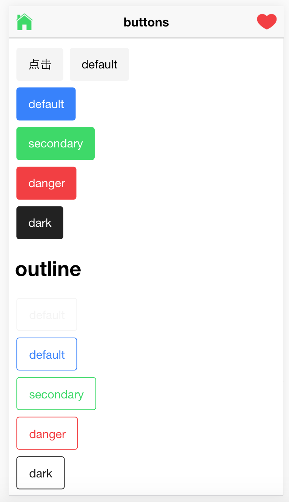
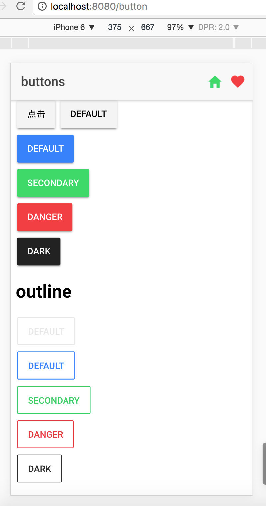
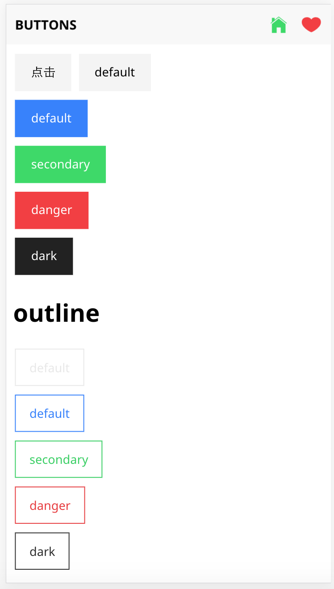

# VUE-IONIC

> ionic ui 的 vue 实现版本
- [Vue官网](http://vuejs.org/)  
- [Ionic官网](http://ionicframework.com/)    

## 启动     

``` bash
# install dependencies
npm install

# 开发 浏览器中查看 http://localhost:8080
npm run dev

# 发布
npm run build

```
> 通常说 可能你按上面执行呢 并木有跑起来, 请联系我 

## 如果喜欢 请star 我们（😍） 

## 已经完成组件（正在努力每周完成一个的速度）
* [ion-button](https://github.com/feedCheicken/vue-ionic/tree/master/src/components/button)
* [ion-icon](https://github.com/feedCheicken/vue-ionic/tree/master/src/components/icon)
* [ion-header](https://github.com/feedCheicken/vue-ionic/tree/master/src/components/header)

## 注 
> 正在筹划开发中 有意贡献代码请联系 xierenyuan@qq.com


## 下边有一大波图 高能 




For detailed explanation on how things work, checkout the [guide](http://vuejs-templates.github.io/webpack/) and [docs for vue-loader](http://vuejs.github.io/vue-loader).
